# Virtualisation sous Proxmox VE — Infrastructure et Politique de Sauvegarde Multi-niveaux

Mise en oeuvre d'une infrastructure virtualisée complète sur **Proxmox VE 8.4**
avec déploiement de quatre machines virtuelles Ubuntu Server et une politique de
sauvegarde à trois niveaux de criticité.

Projet réalisé dans le cadre du **Master 1 Big Data Analytics**
à l'Université Numérique Cheikh Hamidou Kane (UN-CHK).

---

## Résumé

Ce projet implémente une infrastructure virtualisée sur Proxmox VE 8.4 comprenant
quatre VM Ubuntu Server (Web-Server, Database-Server, File-Server, Test-Server)
ainsi qu'une politique de sauvegarde différenciée selon trois niveaux de criticité.
Les sauvegardes utilisent la compression ZSTD en mode snapshot via **vzdump**.

Les tests de restauration ont été réalisés avec succès :
- Restauration complète après suppression totale : **7 secondes**
- Rollback de version après corruption : **6 secondes**
- Débit de sauvegarde mesuré : **472,6 MiB/s**

---

## Environnement technique

| Composant | Version |
|-----------|---------|
| Proxmox VE | 8.4.0 |
| Ubuntu Server | 22.04 LTS |
| Hyperviseur | KVM (Type 1, bare-metal) |
| Compression | ZSTD (Zstandard) |
| Outil de sauvegarde | vzdump (natif Proxmox) |

---

## Architecture de l'infrastructure

```
Serveur physique — Proxmox VE 8.4.0 (noeud : proxmox)

  VM 100              VM 101               VM 102             VM 103
  Web-Server          Database-Server      File-Server        Test-Server
  2 Go RAM            4 Go RAM             2 Go RAM           1 Go RAM
  10 Go disque        10 Go disque         8 Go disque        6 Go disque
  Standard            Critique             Standard           Faible

          |                  |                  |                  |
          └──────────────────┴──────────────────┴──────────────────┘
                                      |
                            vmbr0 + SDN localnetwork
                                      |
                    ┌─────────────────┴─────────────────┐
                    |                                   |
              local-lvm                              local
           (disques VM)                        (archives vzdump)
```

---

## Machines virtuelles déployées

| ID | Nom | Role | RAM | Disque | OS | Criticite |
|----|-----|------|-----|--------|----|-----------|
| 100 | Web-Server | Serveur web (Apache/Nginx) | 2 Go | 10 Go | Ubuntu 22.04 | Standard |
| 101 | Database-Server | SGBD (MySQL/PostgreSQL) | 4 Go | 10 Go | Ubuntu 22.04 | Critique |
| 102 | File-Server | Partage fichiers (NFS/Samba) | 2 Go | 8 Go | Ubuntu 22.04 | Standard |
| 103 | Test-Server | Environnement de tests | 1 Go | 6 Go | Ubuntu 22.04 | Faible |

### Démarrage de l'installation — Menu GRUB

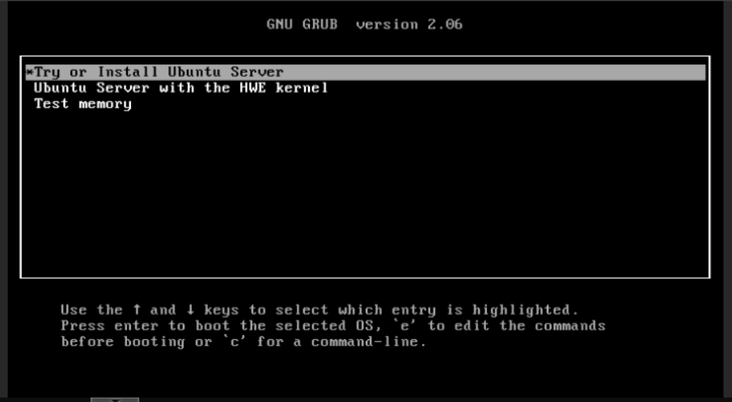

---

## Politique de sauvegarde multi-niveaux

| Niv. | VM | Frequence | Heure | Mode | RTO | RPO |
|------|----|-----------|-------|------|-----|-----|
| 1 — Critique | Database-Server (101) | Quotidienne | 02h00 | Snapshot/ZSTD | < 1h | < 24h |
| 2 — Standard | Web-Server (100) | Bi-hebdo | Lun/Jeu | Snapshot/ZSTD | < 4h | < 48h |
| 2 — Standard | File-Server (102) | Bi-hebdo | Lun/Jeu | Snapshot/ZSTD | < 4h | < 48h |
| 3 — Faible | Test-Server (103) | Hebdo | Dim. 04h00 | Snapshot/ZSTD | < 24h | < 7j |

### Sauvegarde VM 101 — Database-Server (Niveau Critique)

Configuration et journal d'exécution :

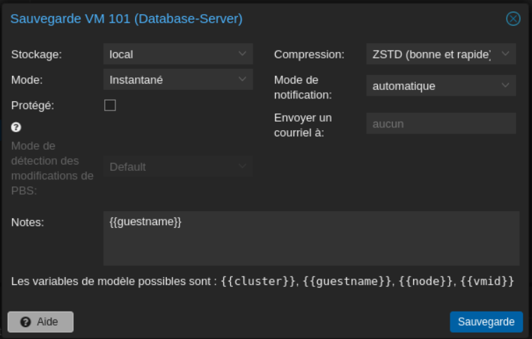

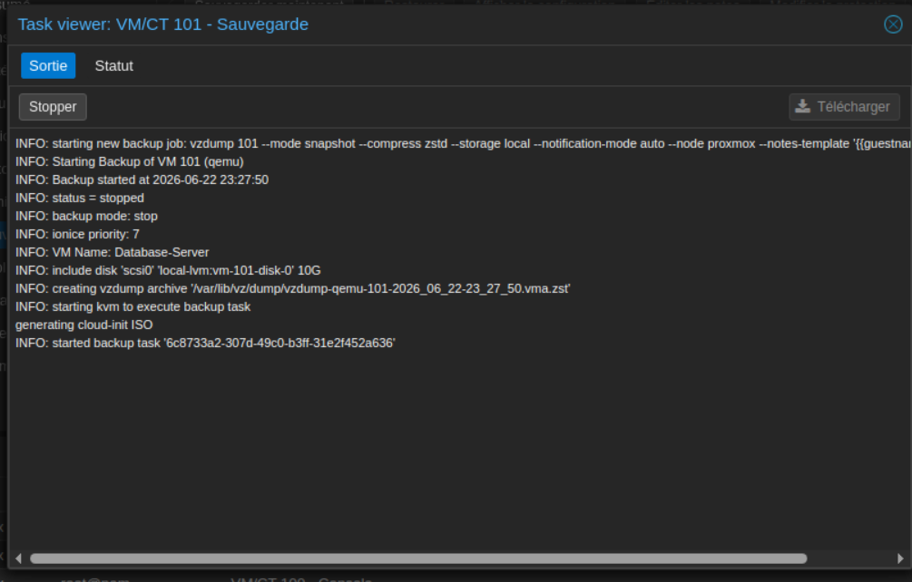

### Sauvegarde VM 102 — File-Server (Niveau Standard)

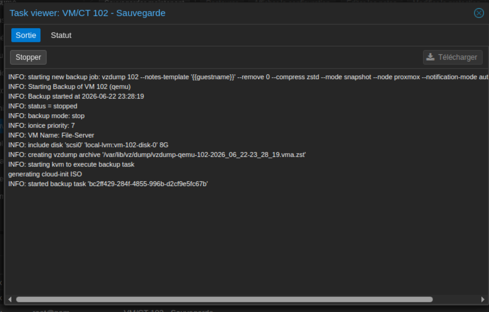

### Jobs planifiés automatisés

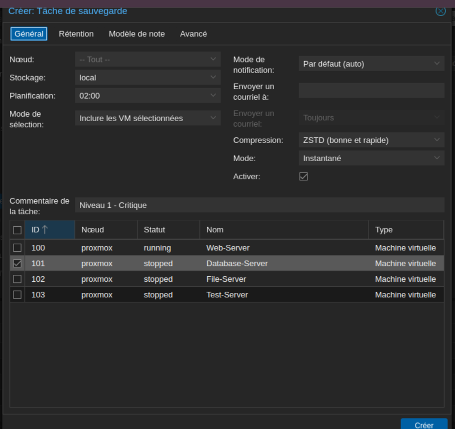

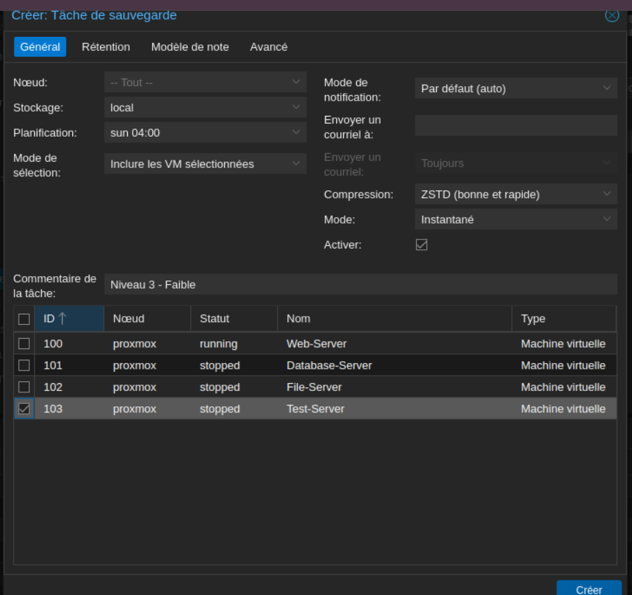

### Archives et performances — VM 103

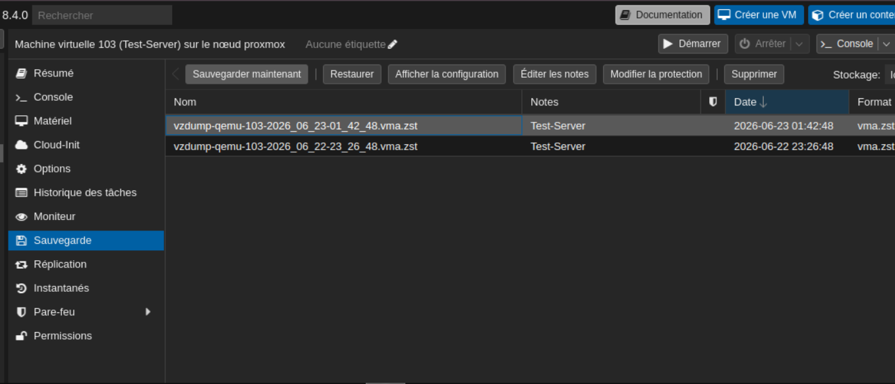

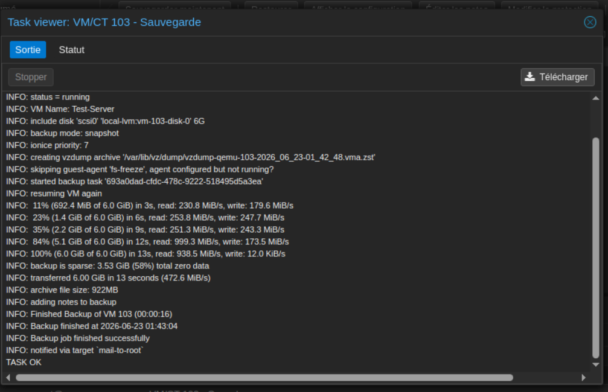

---

## Métriques de performance (VM 103 — disque 6 Go)

| Metrique | Valeur mesuree |
|----------|----------------|
| Duree de sauvegarde | 13 à 16 secondes |
| Debit moyen | 472,6 MiB/s |
| Donnees sparse (non écrites) | 3,53 GiB / 6 GiB (58%) |
| Taille archive ZSTD | 922 Mo |
| Statut final | TASK OK |

---

## Tests de restauration et validation

### Test 1 — Suppression totale et restauration complète

Simulation d'un sinistre grave : suppression accidentelle de VM 103
puis restauration depuis l'archive vzdump.

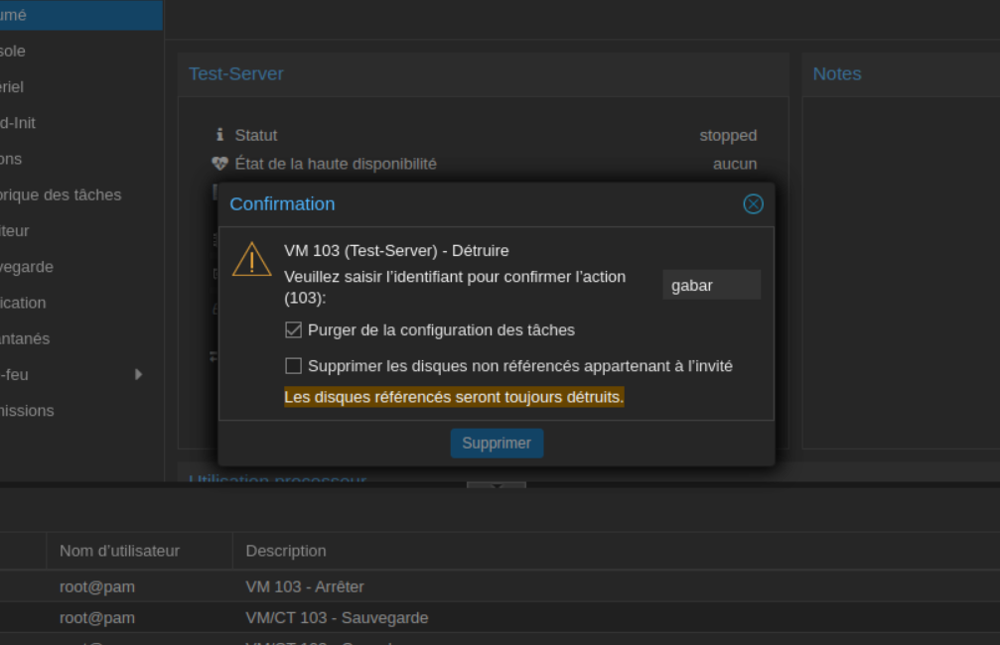

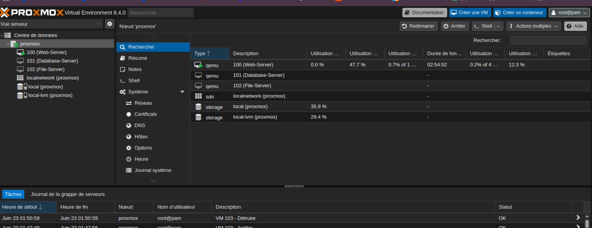

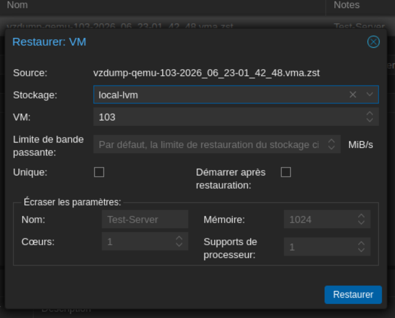

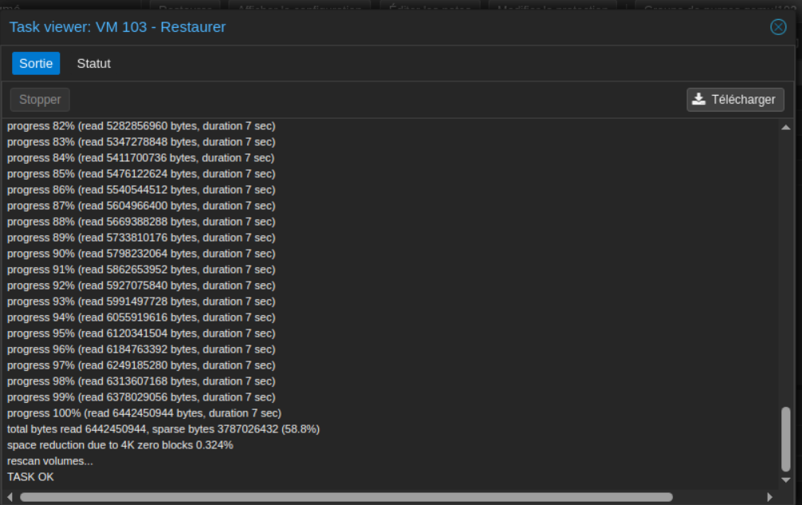

Vérification de l'intégrité des données après restauration :

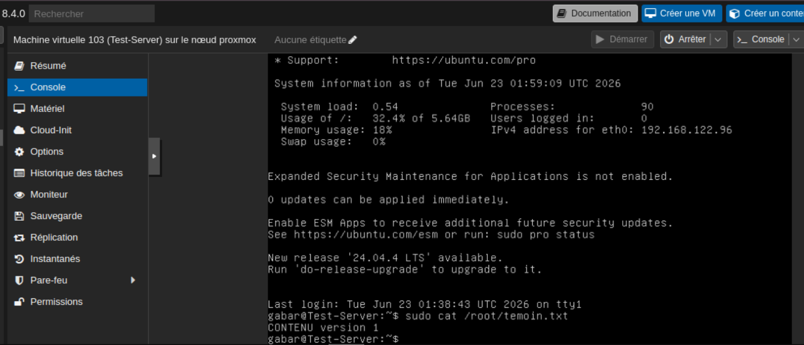

**Resultat : REUSSI — 7 secondes — RTO cible < 24h largement respecté**

---

### Test 2 — Rollback vers une version antérieure

Simulation d'une corruption logique : modification du fichier témoin
puis rollback vers la version sauvegardée.

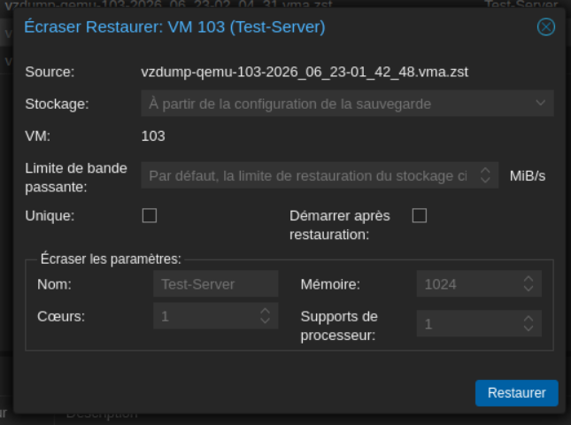

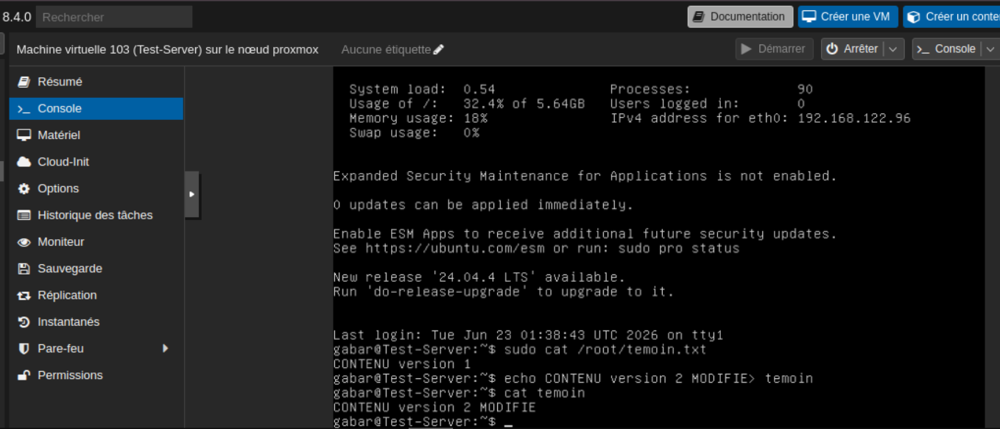

```bash
# Avant rollback
gabar@Test-Server:~$ cat temoin
CONTENU version 2 MODIFIE

# Après rollback
gabar@Test-Server:~$ cat temoin
CONTENU version 1
```

**Resultat : REUSSI — 6 secondes — corruption logique intégralement annulée**

---

### Synthèse des performances

| Test | Scénario | Opération | Durée | RTO cible | Résultat |
|------|----------|-----------|-------|-----------|----------|
| 1 | Sinistre grave | Restauration VM complète | 7 s | < 24h | OK |
| 2 | Corruption logique | Rollback de version | 6 s | < 24h | OK |
| - | Référence | Sauvegarde snapshot VM 103 | 13-16 s | - | 472,6 MiB/s |

---

## Pourquoi ZSTD ?

| Algorithme | Ratio | Vitesse |
|------------|-------|---------|
| LZO | Faible | Très rapide |
| Gzip | Bon | Moyenne |
| ZSTD | Excellent | Très rapide |

Zstandard (ZSTD) offre un ratio comparable à gzip avec une vitesse 3 à 5 fois
supérieure et une décompression très rapide — idéal pour des archives volumineuses
nécessitant une restauration rapide. C'est l'algorithme par défaut dans Proxmox VE.

---

## Difficultés rencontrées et solutions

| Difficulté | Description | Solution |
|------------|-------------|----------|
| Incompatibilité M1 | MacBook M1 incompatible Proxmox bare-metal (x86) | UTM comme hyperviseur sur M1 |
| Agent QEMU absent | Avertissement fs-freeze failed lors des snapshots | Mode snapshot maintenu |
| Choix stockage | Confusion local vs local-lvm lors des restaurations | local-lvm systématique pour les VM |
| Validation nocturne | Jobs planifiés à 02h00 — impossible d'attendre | Exécution manuelle pour validation |

---

## Perspectives d'amélioration

**Court terme**
- Installer qemu-guest-agent pour des snapshots fsfreeze cohérents
- Configurer des politiques de rétention (7 quotidiennes + 4 hebdomadaires)
- Activer les notifications e-mail en cas d'échec de sauvegarde

**Moyen terme**
- Ajouter un stockage NFS externe (règle 3-2-1)
- Déployer Proxmox Backup Server (PBS) pour la déduplication
- Configurer la réplication vers un second noeud

**Long terme**
- Cluster Proxmox multi-noeuds (Corosync/HA)
- Automatisation via API REST (Python/Terraform)
- Snapshots Ceph pour architectures hyperconvergées

---

## Auteurs

**Ndeye Sokhna Nokho** — [Portfolio](https://portfolio-nsn.netlify.app) · [LinkedIn](https://www.linkedin.com/in/ndeye-sokhna-n-02327b373)

Ibrahima Gabar Diop · Isselmou Sidi Oumou

---

*Projet de virtualisation — Master 1 Big Data Analytics*
*Professeur : M. Ibou FAYE — Administrateur Réseaux-Systèmes / Data Scientist*
*Université Numérique Cheikh Hamidou Kane (UN-CHK) — 2024-2025*
